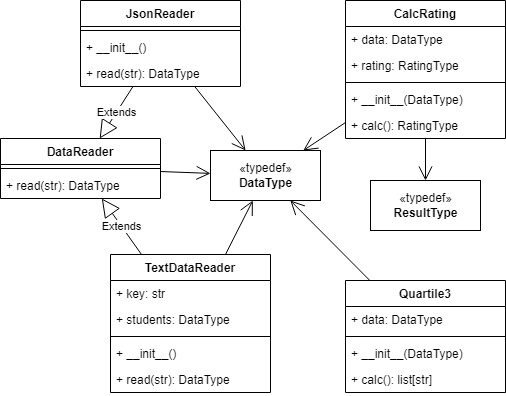

# Лабораторная работа 1 по дисциплине "Технологии программирования"

**Знакомство с системой контроля версий Git и инструментом CI/CD GitHub Actions**

Выполнил: Ст.гр. САПР-1.4 Шебаршов Артем

## Цели

1. Познакомиться c распределенной системой контроля версий кода Git и ее функциями;
2. Познакомиться с понятиями «непрерывная интеграция» (CI) и «непрерывное развертывание»
(CD), определить их место в современной разработке программного обеспечения;
3. Получить навыки разработки ООП-программ и написания модульных тестов к ним на
современных языках программирования;
4. Получить навыки работы с системой Git для хранения и управления версиями ПО;
5. Получить навыки управления автоматизированным тестированием программного обеспечения,
расположенного в системе Git, с помощью инструмента GitHub Actions

## Задачи

1. Клонируйте [репозиторий](https://github.com/kpdvstu/PTLab1-2022) и убедитесь в работоспособности программы
2. Загрузите репозиторий на github и убедитесь в прохождении тестов
3. Выберите для Вашего проекта тип лицензии и добавьте файл с лицензией в проект
4. Добавьте в проект файл `.gitignore` и сформируйте его содержимое
5. Добавьте в проект еще один класс – наследник класса `DataReader`, который должен обрабатывать входной файл определенного формата (_согласно индивидуальному варианту, см. таблицу_). Составьте модульные тесты для методов этого класса, постарайтесь покрыть тестами максимально возможный объем кода. Для работы с этим заданием создайте новую ветку кода на основе главной и фиксируйте в нее весь программный код в процессе разработки. Добейтесь выполнения всех тестов проекта, после чего объедините текущую ветку кода с главной
6. Добавьте в проект класс, реализующий расчет определенных характеристик студентов (_согласно индивидуальному варианту, см. таблицу_). Составьте модульные тесты для методов этого класса, постарайтесь покрыть тестами максимально возможный объем кода. Для работы с этим заданием создайте новую ветку кода на основе главной и фиксируйте в нее весь программный код в процессе разработки. Добейтесь выполнения всех тестов проекта, после чего объедините текущую ветку кода с главной 
7. Составьте UML-диаграмму классов итогового проекта 
8. Проанализируйте полученные результаты и сделайте выводы

## Индивидуальный вариант
| Вариант | Формат входного файла | Расчётная процедура                                                                                              |
|---------|-----------------------|------------------------------------------------------------------------------------------------------------------|
| 11      | JSON                  | Определить и вывести на экран всех студентов, чей рейтинг попадает в третью квартиль распределения по рейтингам. |

## Используемые язык и библиотеки

Используется язык `Python 3.10` со следующими библиотеками:

- pycodestyle
- pytest

## Краткое описание проекта

Проект представляет собой программу для работы с рейтингом учеников/студентов. В базовом виде программа позволяет загрузить данные из текстового файла и вычислить среднее значение баллов студента. После реализации индивидуального задания программа может загружать данные из `.json` файлов и определять студентов входящих в 3-ю квартиль рейтинга. Для каждой из функций программы реализованы unit-тесты.

### UML-диаграмма проекта

## Выводы

Выполнив лабораторную работу я познакомился с понятиями «непрерывная интеграция» (CI) и «непрерывное развертывание»
(CD) и научился использовать `GitHub Actions` для автоматического тестирования кода с использованием `pytest` и `pycodestyle`.
